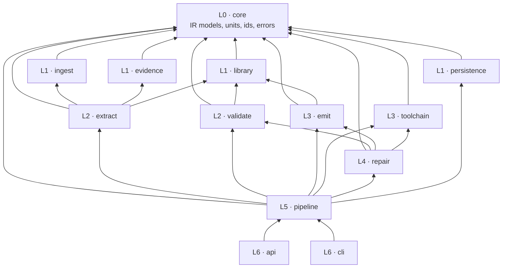

# ARCHITECTURE OF SpecForge Toolkit

## Key Architecture Guidelines
Always follow the decisions in `ADR.md`.

### The one-line architecture

**Mixed engineering inputs → evidence with authority → one validated IR → two deterministic emitters → a
compile gate.**

Everything else is detail. The three load-bearing consequences:

1. **The LLM extracts judgment into a typed schema. It never emits target syntax.** (ADR-001)
2. **Every model element carries provenance, or it cannot serialise.** (ADR-005)
3. **The pipeline is runnable headless. The API and frontend are clients of it.** (ADR-009)

### Layers

Modules are organised in strict layers. **Higher layers may depend on lower layers. Modules in the same layer
may not depend on each other. All dependencies must be acyclic.** Verified by
`test/unit/test_layer_dependencies.py`.

| Layer | Modules | May depend on |
|---:|---|---|
| **L0** | `core` | — |
| **L1** | `ingest`, `evidence`, `library`, `persistence` | L0 |
| **L2** | `extract`, `validate` | L0–L1 |
| **L3** | `emit`, `toolchain` | L0–L2 |
| **L4** | `repair` | L0–L3 |
| **L5** | `pipeline` | L0–L4 |
| **L6** | `api`, `cli` | L0–L5 |

### Module responsibilities

| Module | Owns | Spec |
|---|---|---|
| `core` | IR Pydantic models, JSON Schema export, unit registry (pint), deterministic id generation, error types | `03_system_ir_spec.md` |
| `ingest` | File loaders, fragments and locators, vision extraction, alias resolution, caching | `04_ingestion_spec.md` |
| `evidence` | Authority tiers, the transmission rule, `PRE-01` resolution, conflicts, the standard-assumption catalogue, open questions, the ledger | `05_evidence_precedence_spec.md` |
| `library` | Archetype YAML, retrieval, SysML and Modelica bindings, binding reuse | `06_component_library_spec.md` |
| `extract` | Schema-constrained LLM extraction passes, IR assembly and merge | `16_pipeline_orchestration_spec.md` §4 |
| `validate` | Rule catalogue, the four-gate ladder, round-trip consistency | `09_validation_and_repair_spec.md` |
| `emit` | `sysml/`, `modelica/`, `report/` — Jinja templates and element maps | `07`, `08`, `10` |
| `toolchain` | `omc` and SysML v2 wrappers, simulation runner, liveness checks | `08_modelica_emission_spec.md` §6 |
| `repair` | Diagnostic parsing, localisation, bounded repair loop, IR patching | `09_validation_and_repair_spec.md` §5 |
| `pipeline` | LangGraph graph, state, checkpoints, event bus, prompts, record/replay | `16_pipeline_orchestration_spec.md` |
| `persistence` | SQLAlchemy models, repositories, Alembic migrations | `13_data_model_spec.md` |
| `api` | FastAPI routes, SSE, OpenAPI | `12_api_spec.md` |
| `cli` | Typer commands, `doctor`, `bench` | `12_api_spec.md` §8 |

### Rules that must not be violated

| # | Rule | Enforced by |
|---:|---|---|
| A1 | **Emitters read only a validated IR.** No emitter touches raw files, fragments or LLM output | `test_emitter_inputs.py` |
| A2 | **Emitters never infer.** A missing value is an upstream defect, not a template default | code review + `test_emit_total.py` |
| A3 | **No LLM call in `emit/` or `validate/`** | `test_no_llm_in_emit.py` |
| A4 | **No case-specific logic in `src/`** — no benchmark name, tag or bundle filename | `test_no_case_specific_logic.py` |
| A5 | **Repairs patch the IR, never emitted text** | `test_repair_patches_ir.py` |
| A6 | **Every entity has provenance** | `V-TRACE-001`, blocking |
| A7 | **The pipeline runs without the API, the frontend, or the database** | `test_cli_without_frontend.py`, `test_no_db_mode.py` |
| A8 | **Domain knowledge lives in `library/` data, not in control flow** | review + A4 |

### Implementation guidelines

- Generate the top-level entry point for the application in the `src/` folder.
- Generate and update the package design diagram in `docs/design/packagedesign.md` when a new package is added.
  Markdown with mermaid.js diagrams.
- Every new source file opens with a Purpose comment and is registered in `docs/design/sourcemap.md`.

## Technology Stack

| Area | Choice |
|---|---|
| Backend | **Python 3.11+**, LangGraph, LangChain |
| LLM | **Claude (Anthropic API)** — Opus 5 for reasoning passes, Sonnet 5 for high-volume passes (ADR-002) |
| Frontend | **React**, React Three Fiber, Three.js, React Router, ShadCN/ui + Tailwind, Vite, TypeScript |
| Database | **PostgreSQL 16** (SQLAlchemy 2.x, Alembic) |
| Unit test framework | **PyTest** |
| Other tools/libraries | **SysML v2** toolchain, **PlantUML**, **OpenModelica (`omc`)** + Modelica Standard Library, PyMuPDF, python-docx, openpyxl, pandas, pint, Jinja2, Pydantic v2, FastAPI, Typer |
| Package managers | **uv** (Python), **npm** (frontend) |

### Package naming

The Python package is **`src/spec_forge/`** with an underscore. A hyphen is not a legal Python identifier, so
`spec-forge` cannot be imported. The distribution name remains `spec-forge`; the import name is `spec_forge`.
This is the standard Python convention and resolves the naming used elsewhere in this repository.

### Technology stack specific instructions for code generation

- **Python**: Pydantic v2 for all data models. Full type annotations; `mypy --strict` on `core/` and `emit/`.
  `ruff` for lint and format. Paths via `pathlib` — never string concatenation, because development and the
  demo are on Windows.
- **LLM calls**: always structured output against a Pydantic schema. Never parse free text. `temperature=0`.
  Prompts live in versioned files under `pipeline/prompts/`, never inline in code.
- **Templates**: Jinja2 with `trim_blocks` and `lstrip_blocks`. Templates contain no logic beyond iteration and
  conditional inclusion — any decision belongs in the IR.
- **Subprocess**: `omc` invoked with an explicit working directory and a wall-clock timeout. Never `shell=True`.
- **Frontend**: TypeScript types generated from the backend's OpenAPI schema — never hand-written duplicates.
- **Tests**: written before the change (`.agents/workingrules.md`). LLM-dependent tests use recorded fixtures by
  default; live calls are opt-in via `--live`.

## Development Setup
IDE : VsCode. See `docs/devenv.md` for the full environment setup, including the day-one toolchain check.

## Design Documents
- `docs/design/ADR.md` : index of architecture decision records.
- `docs/design/adr/` : the individual ADRs.
- `docs/design/packagedesign.md` : package/module design and dependencies, in mermaid.js format.
- `docs/design/sourcemap.md` : list of source code files and their purpose. Use this to decide which files to
  modify or update during code generation.
