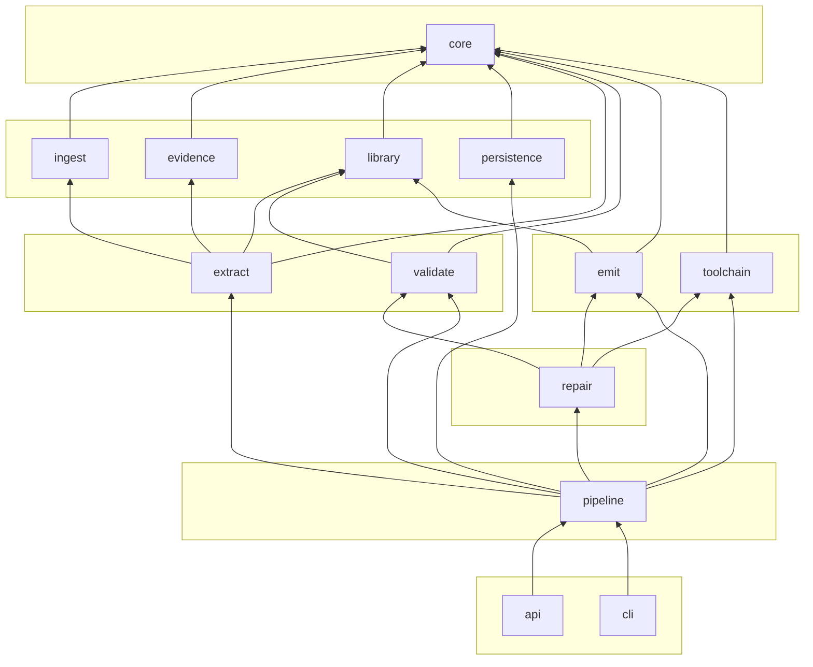
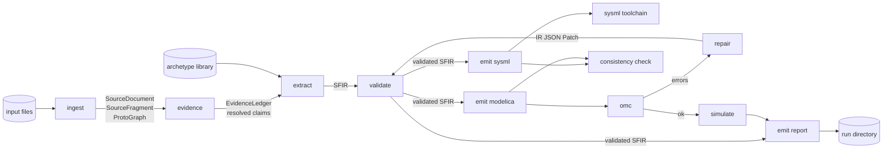

# Package Design — SpecForge Toolkit

Package and module structure with dependencies. Update this file whenever a new package is added
(`docs/design/ARCHITECTURE.md`).

---

## 1. Top-level layout

```
spec-forge/
├── AGENTS.md                  agent instructions
├── DECISIONS.md               daily decision log        ← submission artifact
├── AI-LOG.md                  AI override cases         ← submission artifact
├── README.md                  setup, quickstart, the compile command
├── pyproject.toml             uv / packaging
├── docker-compose.yml         postgres
├── .agents/                   agent config, skills, memory, prompts
├── docs/                      specifications, design, devenv, implementation plan
├── src/
│   ├── main.py                application entry point
│   └── spec_forge/            the Python package  (ADR-014)
├── frontend/                  React SaaS
├── test/                      plans, unit tests, test data
├── build/                     generated schemas, omc scripts, caches
└── runs/                      per-run artifacts (gitignored except demo runs)
```

## 2. Python package

```
src/spec_forge/
├── core/                L0
│   ├── ir/              Pydantic IR models: part, port, connection, attribute,
│   │                    state_machine, constraint, requirement, provenance,
│   │                    assumption, conflict, open_question, trace, document
│   ├── units.py         pint registry, dimensional helpers
│   ├── ids.py           deterministic id generation
│   ├── schema.py        JSON Schema export
│   └── errors.py
├── ingest/              L1
│   ├── loaders/         pdf, docx, xlsx, tabular, email, plaintext,
│   │                    plantuml, modelica, structured, image
│   ├── vision.py        Claude vision, structured output
│   ├── dispatch.py      content sniff → loader
│   ├── aliases.py       alias harvesting and resolution
│   ├── cache.py         content-addressed cache
│   └── manifest.py      case manifest loading (test fixtures only)
├── evidence/            L1
│   ├── tiers.py         the 12-tier model
│   ├── transmission.py  authority-of-record detection
│   ├── precedence.py    PRE-01 resolution
│   ├── conflicts.py
│   ├── assumptions.py + standard_assumptions.yaml
│   ├── questions.py
│   ├── ledger.py
│   └── report.py
├── library/             L1
│   ├── archetypes/      fluid.yaml air.yaml control.yaml sensor.yaml
│   │                    magnetic.yaml electrical.yaml thermal.yaml
│   ├── local/           project-local overrides
│   ├── model.py         archetype schema
│   ├── retrieval.py     deterministic → lexical → semantic
│   └── bindings.py      cross-run binding reuse
├── persistence/         L1
│   ├── models.py  repositories.py  session.py  migrations/
├── extract/             L2
│   ├── passes/          structural, topology, attributes, requirements,
│   │                    behaviour, constraints, record_detection
│   ├── merge.py         IR assembly, merge order
│   └── client.py        Anthropic client wrapper, recording
├── validate/            L2
│   ├── rules/           trace, unit, topology, behaviour, physics, library, modelica
│   ├── ladder.py        the four gates
│   ├── consistency.py   SysML ↔ Modelica round trip
│   └── reference.py     reference-trace comparison
├── emit/                L3
│   ├── sysml/           emitter.py + templates/
│   ├── modelica/        emitter.py + templates/ + strategies/
│   └── report/          summary.py traceability.py plots.py
├── toolchain/           L3
│   ├── omc.py           compile, simulate, liveness
│   ├── sysml.py         SysML v2 toolchain wrapper
│   └── doctor.py        environment checks
├── repair/              L4
│   ├── diagnose.py  localise.py  actions.py  loop.py
├── pipeline/            L5
│   ├── graph.py  state.py  events.py  checkpoints.py  replay.py
│   └── prompts/         versioned prompt files per pass
├── api/                 L6
│   ├── app.py  routes/  schemas.py  sse.py  deps.py
└── cli/                 L6
    └── main.py          run, ingest, emit, compile, simulate, bench, doctor, db
```

## 3. Dependency graph



**Invariants:** acyclic; higher layer → lower layer only; no intra-layer dependency.
Verified by `test/unit/test_layer_dependencies.py`.

## 4. Data flow



The single narrow waist is **SFIR**. Everything to its left is evidence gathering; everything to its right is
deterministic projection. That is ADR-001 drawn as a picture.

## 5. Frontend

```
frontend/src/
├── routes/         projects, project, ingest, run, evidence, model, questions,
│                   artifacts, simulation
├── components/     ui/ (ShadCN) · evidence/ (ConflictCard, ClaimInspector,
│                   FragmentViewer) · model/ (Tree, Graph, Scene3D,
│                   ProvenanceBadge) · run/ (StatusStrip, CompileGate,
│                   CoverageCard) · questions/
├── lib/            api client, SSE client, types generated from OpenAPI
└── hooks/          useRun, useEvents, useSelection
```

`frontend/` depends on the API contract only, never on Python modules (ADR-009).

## 6. Adding a package

1. Decide its layer; confirm it needs nothing from its own layer or above.
2. Create the directory with `__init__.py` and a Purpose comment.
3. Register every file in `docs/design/sourcemap.md`.
4. Update this document's tree and mermaid graph.
5. If it introduces a cross-cutting decision, add an ADR.
