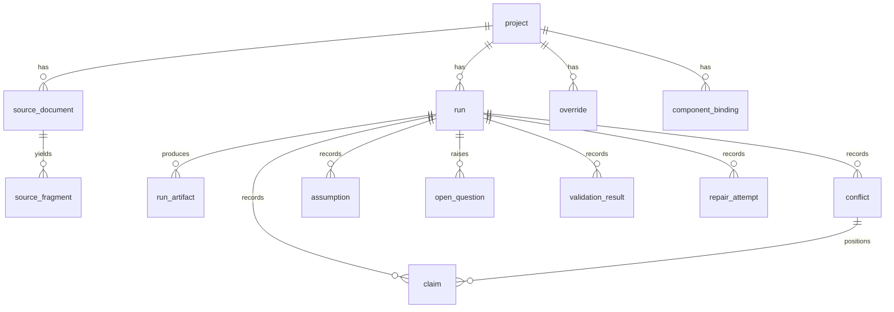

# 13 — Persistence and Data Model

**Status:** Baseline · **Decision:** ADR-008 · **Module:** `src/spec_forge/persistence/`
**Stack:** PostgreSQL 16 · SQLAlchemy 2.x · Alembic migrations

---

## 1. What the database is for

Postgres is in from **Phase 1**. It stores what must outlive a single run:

- **projects and their sources** — so a document set is uploaded once and reused;
- **run history** — every run, immutable, comparable;
- **the evidence ledger** — queryable: *"every claim CR-004 authorises across all runs"*;
- **user overrides and answers at tier 0** — persisted across runs so an engineer answers a question once;
- **component bindings** — the reuse mechanism of SF-EXT-08.

### 1.1 The filesystem remains authoritative for artifact bytes

Generated files (`model.sfir.json`, `model.sysml`, `Model.mo`, plots) live in `runs/<run_id>/` on disk. The
database stores **metadata, relationships and a path/hash**, not the bytes.

Two reasons, and both are defensible under questioning: judges must be able to run the compile command against a
file in the repo with no database running, and artifacts are diffable, greppable and committable as files. The
database earns its place by answering questions files cannot — cross-run queries, persisted overrides, evidence
search — not by becoming a blob store.

## 2. Schema

### `project`
| Column | Type | Notes |
|---|---|---|
| `id` | uuid pk | |
| `name` | text | |
| `description` | text | |
| `created_at` / `updated_at` | timestamptz | |

### `source_document`
| Column | Type | Notes |
|---|---|---|
| `id` | uuid pk | |
| `project_id` | uuid fk | |
| `uri` | text | path or object key |
| `original_filename` | text | |
| `media_type` | text | |
| `sha256` | text | dedupe key within a project |
| `title`, `document_number`, `revision` | text | extracted or manifest-supplied |
| `status` | enum | approved, released, final, draft, superseded, informal, archived |
| `issued_date` | date | |
| `authority_tier` | smallint | 0–11, see `05_evidence_precedence_spec.md` §2 |
| `reliability` | enum | high, medium, low |
| `ingest_method` | text | |
| `notes` | text | |

Unique `(project_id, sha256)`. Index on `(project_id, authority_tier)`.

### `source_fragment`
| Column | Type | Notes |
|---|---|---|
| `id` | text pk | `frag:…`, deterministic |
| `source_id` | uuid fk | |
| `locator` | jsonb | discriminated by `kind` |
| `text` | text | verbatim |
| `modality` | enum | text, table, image, code, structured |
| `extraction_method` | text | |
| `extraction_confidence` | real | |
| `tsv` | tsvector | generated, for full-text search |

GIN index on `tsv` and on `locator`. Full-text search over fragments is what makes *"which document mentions
LT-102?"* answerable in the Evidence view.

### `run`
| Column | Type | Notes |
|---|---|---|
| `id` | uuid pk | ULID-ordered |
| `project_id` | uuid fk | |
| `status` | enum | queued … completed, degraded, failed, cancelled |
| `started_at` / `finished_at` | timestamptz | |
| `config` | jsonb | stages, model ids, seed |
| `git_sha`, `app_version`, `sfir_version` | text | reproducibility |
| `run_dir` | text | path to artifacts |
| `coverage_evidence` / `coverage_assumption` | int | headline numbers |
| `compile_status` | enum | not_run, ok, failed |
| `simulate_status` | enum | not_run, ok, failed, not_applicable |

### `run_artifact`
`id`, `run_id`, `name`, `kind` (ir, sysml, modelica, summary, traceability, evidence, plot, results, compile_log),
`path`, `sha256`, `bytes`.

### `claim`
The evidence ledger, and the most valuable table for questioning.

| Column | Type | Notes |
|---|---|---|
| `id` | uuid pk | |
| `run_id` | uuid fk | |
| `subject_kind` / `subject_id` | text | e.g. `attribute`, `attr:tank_1.high_limit` |
| `quantity` | text | |
| `value_text` / `value_num` / `unit` | text / numeric / text | |
| `value_kind` | enum | requirement, effective_setpoint, nominal_design, as_built_measurement, verification_config, numerical_device, derived |
| `authority_record` | text | `CR-004` |
| `authority_tier` | smallint | |
| `effective_date` | date | |
| `record_status` | enum | approved, proposed, rejected, superseded, null |
| `fragment_ids` | text[] | |
| `selected` | boolean | |
| `conflict_id` | uuid fk null | |

Index on `(run_id, subject_id)` and on `authority_record`.

### `conflict`
`id`, `run_id`, `subject_kind`, `subject_id`, `resolution`, `selected_claim_id`, `rule_applied`, `rationale`,
`severity`.

### `assumption`
`id`, `run_id`, `statement`, `category`, `standard_assumption_id`, `rationale`, `affects` (text[]),
`confidence`, `accepted` (bool null — set by the user).

### `open_question`
`id`, `run_id`, `question`, `why_it_matters`, `blocking`, `candidates` (jsonb), `gates` (text[]),
`answer`, `answered_by`, `answered_at`, `default_taken`.

### `override`
Tier-0 decisions. **Project-scoped, not run-scoped** — this is what makes them persist.

| Column | Type | Notes |
|---|---|---|
| `id` | uuid pk | |
| `project_id` | uuid fk | |
| `origin_run_id` | uuid fk | where it was made |
| `target_kind` / `target_id` | text | IR element addressed |
| `json_patch` | jsonb | |
| `rationale` | text | |
| `author` | text | |
| `created_at` | timestamptz | |
| `active` | boolean | revocable |

### `component_binding`
The reuse mechanism (SF-EXT-08). `id`, `project_id`, `canonical_name`, `tag`, `aliases` (text[]),
`archetype_key`, `archetype_version`, `parameter_overrides` (jsonb), `confidence`, `confirmed_by_user`,
`last_used_run_id`. Unique `(project_id, tag)` where `tag` is not null.

### `validation_result`
`id`, `run_id`, `rule_id`, `severity`, `element_kind`, `element_id`, `message`, `suggested_action`.

### `repair_attempt`
`id`, `run_id`, `attempt_no`, `diagnostic_class`, `action`, `patch` (jsonb), `outcome`, `stderr_excerpt`.

## 3. Relationships

## 4. Migrations

Alembic, in `src/spec_forge/persistence/migrations/`. Every schema change ships with a migration in the same
commit. `spec-forge db upgrade` runs them; `docs/devenv.md` covers first-time setup.

## 5. Determinism and repeatability

`run.config.seed` and the recorded model ids make a run reproducible. `GET /runs/{id}/diff/{other}` compares two
runs **structurally** — part, port and connection sets — rather than textually, because SF-ACC-05 accepts naming
variation and rejects topology variation. `spec-forge bench --repeat 2` uses the same comparison to assert
repeatability in CI.

## 6. Local development

Docker Compose service `postgres:16` on 5432, database `specforge`. `DATABASE_URL` in `.env`.

**Degradation:** if Postgres is unreachable, the CLI runs with `--no-db` and writes only to the filesystem, with
a warning. Persistence must never be able to block the compile gate — the same reasoning that keeps the frontend
out of the pipeline (ADR-009). The API, by contrast, requires the database and reports it red on `/ready`.

## 7. Testing

| Test | Assertion |
|---|---|
| `test_migrations_roundtrip.py` | upgrade → downgrade → upgrade is clean |
| `test_ledger_persistence.py` | Claims and conflicts survive a round trip with positions intact |
| `test_override_persistence.py` | A tier-0 override applies to a later run in the same project |
| `test_binding_reuse.py` | A confirmed binding is reused on a second run |
| `test_no_db_mode.py` | Full pipeline succeeds with `--no-db` |
