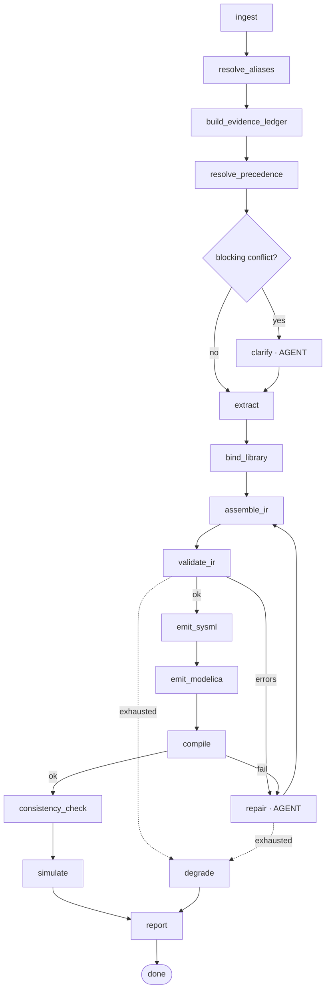

# 16 — Pipeline Orchestration and Agent Design

**Status:** Baseline · **Decisions:** ADR-002, ADR-004 · **Module:** `src/spec_forge/pipeline/`
**Stack:** LangGraph · LangChain · Claude (Anthropic API)
**Answers:** PRD §10 *"How is agentic behaviour used?"*

---

## 1. The governing restraint

> *"Using an agent where a single call would do is not automatically better."* — PRD §10

We expect to be asked to justify every agent. The rule we apply:

**An LLM call is warranted only where the task requires judgment over ambiguous natural language. An agent
(multi-step, tool-using, self-critiquing) is warranted only where the task additionally requires iteration
against feedback the model cannot predict in advance.**

By that test, most of this pipeline is **not** agentic, and deliberately so:

| Stage | Mechanism | Why |
|---|---|---|
| Ingest | Deterministic code | Parsing is not judgment |
| Alias resolution | **Single LLM call** (schema-constrained) | Judgment, one pass, no feedback loop |
| Precedence resolution | **Deterministic algorithm** + single LLM call for record detection | The ranking rule is explicit; only "which record does this text cite" needs judgment |
| Extraction | **Multi-pass LLM**, one pass per concern | Judgment; passes are independent, not iterative |
| Validation | Deterministic rules | Logic, not language |
| SysML emission | Templates | Syntax is not judgment |
| Modelica emission | Templates | Same |
| **Repair** | **Agent** | Genuinely iterative: compiler feedback cannot be predicted |
| **Clarifying dialogue** | **Agent** | Genuinely interactive: user response cannot be predicted |

**Two agents.** Everything else is a single call or plain code. Being able to say that — and say why — is worth
more than a larger agent count.

## 2. Graph



Every edge into `degrade` reaches `report`. There is no path out of this graph that produces nothing
(NFR-REL-01).

## 3. State

```python
class PipelineState(TypedDict):
    run_id: str
    config: RunConfig
    documents: list[SourceDocument]
    fragments: list[SourceFragment]
    proto_graphs: list[ProtoGraph]
    ledger: EvidenceLedger
    ir: SFIR | None
    validation: list[RuleResult]
    artifacts: dict[str, Path]
    repair_attempts: int
    events: EventSink
    status: RunStatus
```

Checkpointed after every node to `runs/<run_id>/checkpoints/`, so a run can resume after a crash and so
`--stages` can re-run one stage against a prior state. This is also what makes iteration cheap during
development: re-running emission does not re-run extraction or re-pay for it.

## 4. Extraction passes

Separate passes, run concurrently where independent, each with its own schema-constrained output. One large
"extract everything" prompt was rejected — it produces lower-quality structure, is impossible to debug, and
cannot be improved one concern at a time.

| Pass | Extracts | Model | Notes |
|---|---|---|---|
| `structural` | Parts, ports, hierarchy | Opus 5 | Seeded by proto-graphs from `.puml` and diagrams |
| `topology` | Connections at port level | Opus 5 | **Prefers the Interface Matrix** when present |
| `attributes` | Parameters, values, units, `value_kind` | Opus 5 | Emits claims into the ledger, not final values |
| `requirements` | Requirement records with status | Sonnet 5 | High volume, mostly structured tables |
| `behaviour` | States, transitions, guards, timers, priorities | Opus 5 | Hardest pass; L1 and L4 depend on it |
| `constraints` | Interlocks, limits, permissives, **scoped exceptions** | Opus 5 | Safety-relevant; conservative |
| `record_detection` | `cites_record`, `record_status`, `effective_date` per fragment | Sonnet 5 | Feeds the transmission rule (`05_…` §3) |

**Merge order:** structural → topology → attributes → behaviour → constraints. Later passes may reference
earlier entities but may not create parts — only the structural pass creates parts, which is how `V-TRACE-002`
(no assumed components) stays enforceable.

### 4.1 Constrained decoding

Every pass uses tool-use / structured output against a Pydantic schema. No free-text parsing anywhere. A pass
that returns invalid JSON is retried once with the validation error, then fails the stage — it is never
"best-effort parsed", because a partially parsed extraction is indistinguishable from a confident fabrication.

## 5. The two agents

### 5.1 Repair agent

Scope, tools and bound are specified in `09_validation_and_repair_spec.md` §5. In graph terms: it is the only
node permitted to loop, it is bounded at 3 attempts, it patches the **IR** and never emitted text, and every
attempt is recorded.

It qualifies as an agent because the compiler's response to a fix cannot be predicted — the loop is genuinely
closed over external feedback.

### 5.2 Clarification agent

Turns unresolved conflicts and gaps into a ranked, deduplicated question queue; drafts candidate answers from
losing conflict positions; incorporates answers as tier-0 claims and re-runs precedence. Interactive in the UI,
and in CLI mode it degrades to stated defaults without blocking (`--non-interactive`).

## 6. Model selection

| Task | Model | Why |
|---|---|---|
| Structural, topology, behaviour, constraints extraction | **Opus 5** | Hardest reasoning; errors here propagate everywhere downstream |
| Requirements, record detection, high-volume passes | **Sonnet 5** | Structured, high volume, cost-sensitive |
| Vision (diagrams, image-only PDF pages) | **Opus 5** | Diagram comprehension is the highest-fabrication-risk step |
| Repair diagnosis | **Opus 5** | Compiler errors are terse and need domain inference |

Model ids are configuration, recorded per run in `manifest.json` (NFR-DET-05). See ADR-002.

## 7. Prompt management

Versioned files in `src/spec_forge/pipeline/prompts/<pass>/v<N>.md`, with the version recorded in `run.config`.
Every prompt states: the closed set of archetypes it may choose from, the output schema, and the honesty rule —
*if it is not in the provided fragments, return it as an open question, not a value.*

Prompts are code and are reviewed as code. A prompt change that alters extraction behaviour is a change to the
product and belongs in `DECISIONS.md`.

## 8. Recording and replay

Every LLM request/response pair is written to `runs/<run_id>/llm/<pass>/<seq>.json` with model id, prompt
version, token counts and latency. `--replay <run_id>` serves every call from that record with **zero network
access** (NFR-REL-05, ADR-013).

Replay serves three purposes, in increasing order of importance: fast iteration, deterministic tests, and a
working demo when the venue network fails.

## 9. Concurrency and limits

Independent extraction passes run concurrently with a bounded semaphore. Rate-limit and overload errors retry
with exponential backoff (max 3, NFR-REL-02). Every stage has a wall-clock timeout; exceeding it degrades that
stage rather than hanging the run — a hung stage in a 10-minute demo slot is worse than a stated gap.

## 10. Testing

| Test | Assertion |
|---|---|
| `test_graph_terminates.py` | Every path reaches `report`; no cycle is unbounded |
| `test_no_part_creation_late.py` | Only the structural pass creates parts |
| `test_schema_constrained.py` | Every pass validates its output against its schema |
| `test_replay_no_network.py` | Replay runs with networking disabled |
| `test_checkpoint_resume.py` | A killed run resumes from its last checkpoint |
| `test_agent_count.py` | Exactly two looping nodes exist — guards against agent creep |
